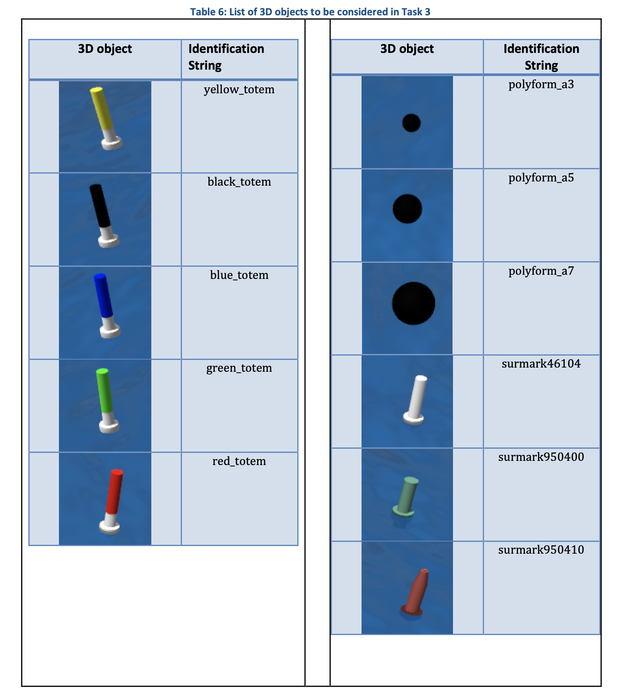

## Kanaloa's Darknet
This documentation is written for the purpose of setting up and configuring Darknet for Kanaloa's participation in RobotX competition. It is being utilized For the purpose of object classification for objects found in the competition.



### 1. Darknet Installation
Darknet is an open source neural network framework written in C and CUDA by Joseph Redmon ([pjreddie](https://github.com/pjreddie/darknet)). The one that Kanaloa uses is a forked repository that has been modified by [AlexeyAB](https://github.com/AlexeyAB/darknet).

To install this version of Darknet, run
```bash
git clone https://github.com/AlexeyAB/darknet.git
```

Once it your have cloned the repository to your computer, change directories to the Darknet workspace.
```sh
cd darknet
```
Then compile
```sh
make
```

### 2. Darknet Set-up
Note: File names used in this documentation are just examples. It is highly suggest you used detailed names as there are many `.cfg` and `.data` files that come included with the cloned darknet repository.

#### 2.1 Darknet Configuration Files
Darknet requires the usage of configurations files (`.cfg`) for training. 
It contains parameters such as:
- learning_rate
- angle
- saturation
- exposure
- hue

Structure of the neural network layers:
- filters
- activation
- stride

Then the You Only Look Once (YOLO) layers and number of filters that will need to be modified:
- classes = # of classes in dataset
- filters = (classes + coordinates + 1) * mask
    - coordinates will be 4 as we have: center x, center y, width, and height, from our YOLO files
- [Here is the `.cfg` file for the VRX objects]()

#### 2.2 Darknet Needed Files
Darknet requires the following files:
- `darknet/images/classes.names`
- `darknet/cfg/custom_data.data`
- `darknet/cfg/custom_train.cfg` (name to match network/usage)
- `darknet/cfg/custom_test.cfg` (optional, name to match network/usage)
- `darknet/images/train.txt`
- `darknet/images/test.txt`

##### Classes
The `classes.names` file should include the names of the classes you will be training Darknet to look for. These names should be in the same order as the classes defined in your YOLO files. If your YOLO classes are predefined in this order
```
surmark
totem
polyform
```
Then your `classes.names` file will be written in the same exact way. 

##### Custom Data
`custom_data.data` should include the following information:
- number of classes
- path to `train.txt`
- path to `test.txt`
- path to `classes.name`
- backup name

Here is an example of how it may look in the end
```
classes = 3
train = /home/kevin/Desktop/darknet/images/train.txt
valid = /home/kevin/Desktop/darknet/images/test.txt
names = /home/kevin/Desktop/darknet/images/classes.names
backup = backup
```

##### Custom Train amd Test
These two files are configured slightly different. You can find the full files Kanaloa uses [here](). 

##### Train and Test

